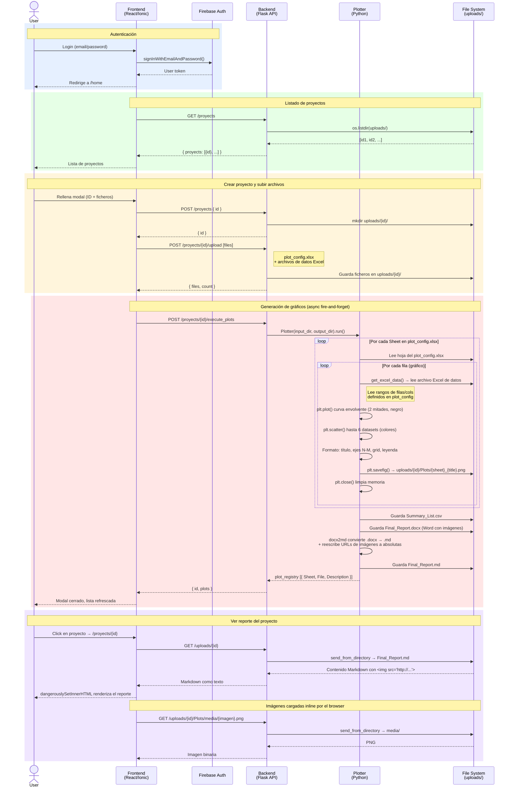

# Project Overview — PlotMe

## Sequence Diagram

## Flow Summary

| Phase | What happens |
|---|---|
| **Auth** | Firebase manages login/signup; token stays on the client |
| **Projects** | Flask lists folders inside `uploads/` as projects |
| **Upload** | Files (`plot_config.xlsx` + data Excel files) are saved to `uploads/{id}/` |
| **Plotter** | Reads `plot_config.xlsx` sheet by sheet → row by row defines what data to plot and how → matplotlib generates PNGs → packed into `.docx` → converted to `.md` |
| **Report** | Frontend fetches the `.md` and renders it with `innerHTML`; images are served directly by Flask |

## Plotter detail (`server/core/plotter.py`)

1. **Config file**: `uploads/{id}/plot_config.xlsx` — one sheet per group of graphs, one row per graph.
2. **Envelope curve**: two independent halves read from a diagram Excel file (`Diag_*` columns), plotted as black lines.
3. **Scatter datasets**: up to 6 additional Excel files (`File1_*` … `File6_*` columns), each plotted as colored scatter points.
4. **Output per graph**: PNG saved to `uploads/{id}/Plots/`.
5. **Final output**: `Summary_List.csv` + `Final_Report.docx` + `Final_Report.md` (image URLs rewritten to absolute Flask endpoints).
